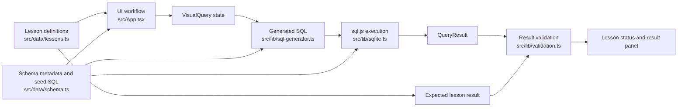

# Architecture

AprenDB is a browser-based visual SQL lesson sandbox. Learners build a `VisualQuery` through the schema graph and menus, the app turns that visual state into SQL, executes the SQL against an in-browser SQLite database, and compares the result with the active lesson's expected result.

## Application Flow

The main data path is:

1. `src/data/lessons.ts` provides lesson goals, tips, and exact expected results.
2. `src/data/schema.ts` provides table and relationship metadata for the visual graph, plus SQL seed data for the in-browser SQLite database.
3. `src/App.tsx` stores the current `VisualQuery` in React state as the learner chooses a base table, joins tables, selects columns, filters, sorts, and sets a limit.
4. `src/lib/sql-generator.ts` converts the current `VisualQuery` and schema metadata into a SQL string.
5. `src/lib/sqlite.ts` initializes sql.js, seeds a SQLite database from `commerceSeedSql`, and executes generated SQL.
6. `src/lib/validation.ts` compares the executed query result with the active lesson's expected result.
7. `src/App.tsx` displays the generated SQL, result table, expected row count, and lesson status.

## Main Responsibilities

### `src/App.tsx`

`App.tsx` is the main application shell. It owns UI state for the active lesson, passed lessons, current visual query, latest result, status message, action menu, and panel sizes.

It also coordinates the layout and user workflow:

- Left panel: lesson list, current goal, and lesson tips.
- Center panel: React Flow schema graph, relationship edges, table nodes, column actions, and table join actions.
- Right panel: lesson status, generated SQL, result preview, query summary, limit input, and preview button.

When the learner previews a query, `App.tsx` sends the generated SQL to `executeSql`, validates the returned `QueryResult` with `validateLessonResult`, and updates the lesson status.

### `src/lib/query-model.ts`

`query-model.ts` contains pure helpers for visual query state. These functions create and transform `VisualQuery` objects without touching React or sql.js.

The helpers cover:

- creating an empty query;
- setting the base table;
- adding or removing joins;
- toggling selected columns;
- adding, updating, and removing filters;
- setting sort and limit state;
- resolving joined table ids from the base table and relationships;
- finding tables, columns, and relationships in the schema;
- formatting column references for generated SQL and UI summaries.

Relationship reachability lives here. The UI uses these helpers to decide which tables can be joined next, which columns are usable, and which query state should be removed after a join is deleted.

### `src/lib/sql-generator.ts`

`sql-generator.ts` converts a `VisualQuery` into a SQL string using schema metadata. It emits:

- `SELECT` with the chosen columns, or `SELECT *` when no columns are selected;
- `FROM` for the selected base table;
- reachable `INNER JOIN` or `LEFT JOIN` clauses;
- `WHERE` filters for reachable tables;
- `ORDER BY` when the sorted column is reachable;
- `LIMIT` when a limit is set.

If there is no base table, or if the selected base table does not exist, it returns a SQL comment string instead of an executable query.

### `src/lib/sqlite.ts`

`sqlite.ts` owns database initialization and execution. It loads sql.js with the Vite-managed WASM URL, creates one in-memory SQLite database, runs `commerceSeedSql`, and reuses that database through a cached promise.

`executeSql` skips comment-only placeholder SQL by returning an empty result. For executable SQL, it calls `database.exec(sql)` and maps the first sql.js result set into the app's `QueryResult` shape.

### `src/lib/validation.ts`

`validation.ts` compares actual query results with a lesson's expected result. Validation is exact:

- actual result must exist;
- column names must match in order;
- row count must match;
- each row must match in order;
- each cell value must match with strict equality.

## Data Boundaries

Schema metadata and SQLite seed SQL live together in `src/data/schema.ts`.

- `commerceSchema.tables` drives the graph nodes, column menus, labels, column types, and table positions.
- `commerceSchema.relationships` drives graph edges and the relationships that can be joined.
- `commerceSeedSql` creates and populates the SQLite tables used during query execution.

Lesson definitions live in `src/data/lessons.ts`.

- Each lesson contains the learner-facing goal and tips.
- Each lesson also contains the exact `expectedResult` used by validation after SQL execution.

Keep these boundaries in sync: lessons should expect results that can be produced from the seeded SQLite data, and schema metadata should describe the same tables, columns, and relationships that exist in `commerceSeedSql`.
